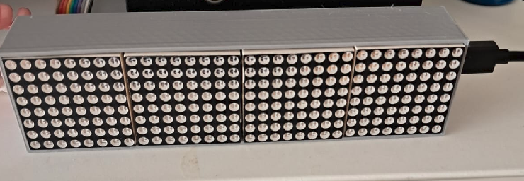
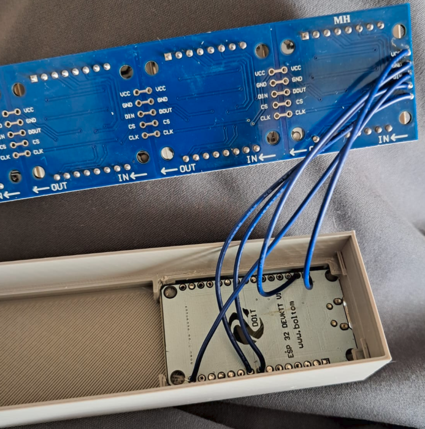
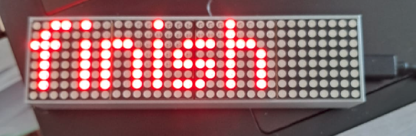

# Whatsapp-to-ESP32-Display

> Send a Whatsapp message to **esp32 devkit v1** and it will be displayed on the **MAX7219 LED Matrix** using [twilio](https://www.twilio.com/en-us) and [thing_esp](https://thingesp.siddhesh.me/#/). 

## Hardware

### Wiring

| esp32 devkit v1 | maxMAX7219 LED Matrix |
|:----------------|:----------------------|
|CLK_PIN 18  | or SCK |
|DATA_PIN 23 | or MOSI |
|CS_PIN 5    | or SS |
|VCC | 5v |

## :rocket: Set up

- Follow these tutorials to set up twilio an thing_esp.
    - https://www.youtube.com/watch?v=yqOQSdaf8TA&list=LL&index=8&t=1s
    - https://www.youtube.com/watch?v=BCqJWWGHQPM&list=LL&index=6

- Use PlatformIO to flash the ESP32 devkit v1.
- Open Wifi settings and scan for ESP32AP and connect.
- The Password is: password
- Open browser and type 192.168.4.1 in the search bar.
- Configure Wifi
- Select your Wifi AP and enter your Password.
- If it successfully connected it will show the welcome message and time.

## :wrench: usage
### :page_facing_up: Send Whatsapp message
- Open Whatsapp and send `join soap-completely` to twilio. This is neccessary because we're still using the developer service. Every 3 days we need to send the message again to activate twilio.
- Now send any message with latin characters to the display.

### Advanced 
- Try sending `help` it list a the avialable commands.
- Wtih `off` you can turn the display off. Just send a new message and it will be on again.

